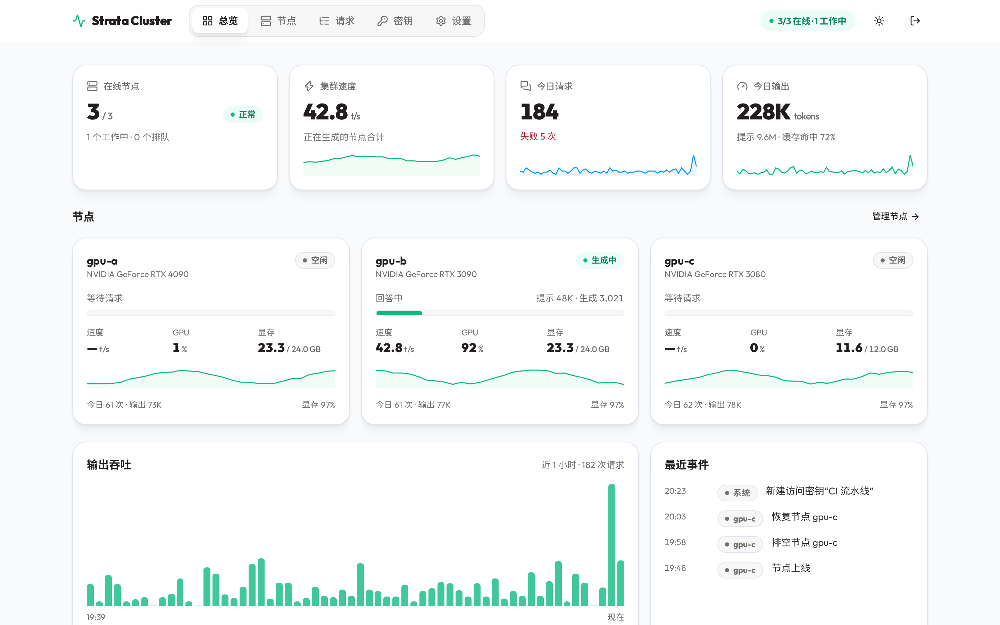
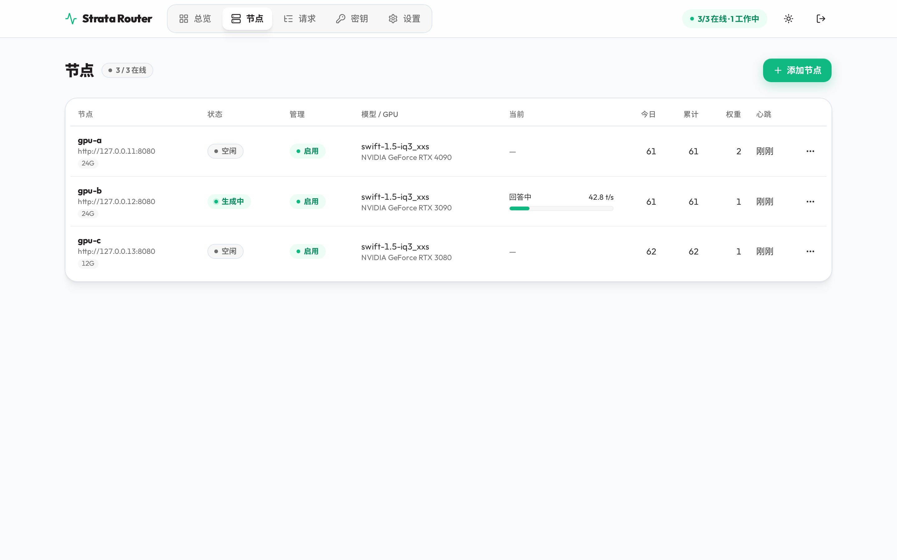
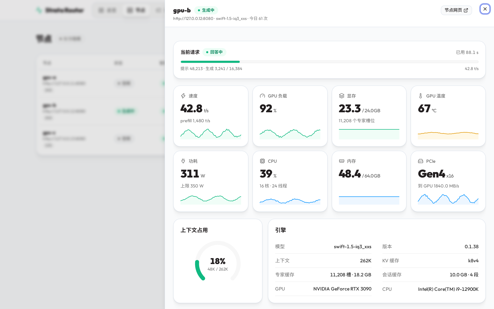
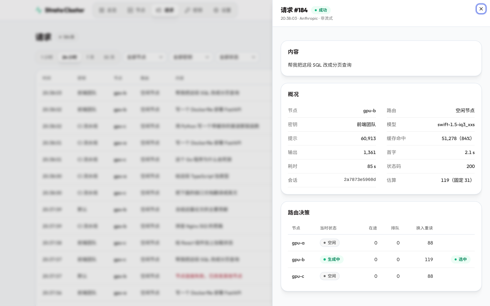
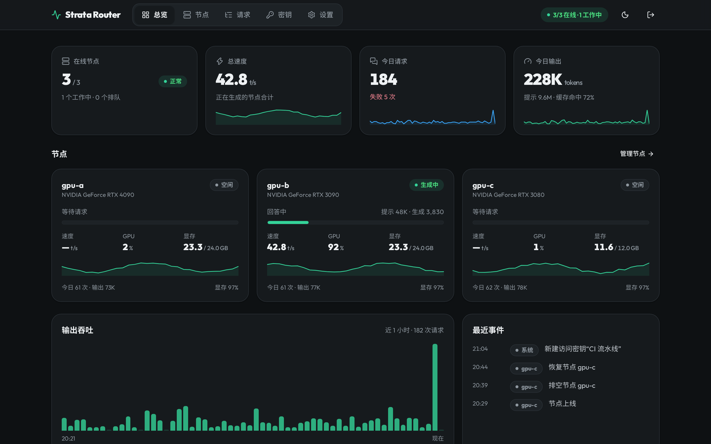

# strata-router

中文 | [English](README.en.md)

多台 [Strata](https://github.com/Niko1221/Strata) 机器的统一入口与管理控制台。客户端（Claude Code、OpenAI 兼容客户端等）只需把地址换成入口，请求会按规则分到各节点；接口与 Strata 相同（`/v1/messages`、`/v1/chat/completions`、`/v1/models` 等）。OpenAI Responses 接口 `/v1/responses` 直接转发给节点（需要 Strata 0.1.39 及以上）。

## 功能

- **会话粘性**：以“系统提示 + 第一条用户消息”识别同一会话，优先回到上次的节点，复用节点上的 KV 缓存。
- **忙时换节点**：原节点忙时估算换到空闲节点需要重读的 token（剔除目标节点已缓存的系统提示与工具列表），不超过阈值就换，否则排队。
- **分配策略**：平均分配、按负载、随机、按权重；节点可启用、排空、停用，连接失败自动改发其他节点。
- **访问密钥**：多个密钥，可启停、重命名，统计今日与累计用量。
- **控制台**（`/admin`）：总览、节点（硬件指标、当前请求进度、引擎配置）、请求记录与路由决策、密钥、设置；浅色 / 深色主题，中文 / 英文界面。

## 截图

以下截图用模拟节点和示例数据生成。

总览：节点状态、总速度、今日用量与近 1 小时输出吞吐



节点列表与节点详情（硬件指标、当前请求进度、引擎配置）





请求记录与路由决策



深色主题



## 运行

后端只用 Python 标准库（3.9 及以上）。控制台需要先构建：

```bash
cd web && pnpm install && pnpm build && cd ..
cp config.example.json config.json   # 填入节点地址与节点自己的 api_key
cd backend && python3 -m strata_router ../config.json
```

默认监听 `0.0.0.0:8099`。首次启动会生成管理员初始密码，写在配置文件同目录的 `initial-admin-password.txt`（仅本人可读）；用它登录 `http://<主机>:8099/admin` 后请在“设置”里修改。配置里的 `api_key` 首次启动会迁移为名为“默认”的访问密钥，之后在控制台管理。节点也可以在控制台里添加。

长期运行可参考 `deploy/strata-router.service.example` 配置 systemd 用户服务。

## 测试

```bash
cd backend && python3 -m unittest discover tests -v
```

测试用本地模拟的 Strata 节点运行，不需要真实机器。

## 目录结构

```
backend/strata_router/   后端（入口与转发、节点与路由、存储、管理接口）
backend/tests/           后端测试
web/                     控制台前端
deploy/                  systemd 服务模板
docs/                    需求、规划、更新记录与截图
```

## 文档

- [需求说明](docs/需求.md)：分配规则、控制台与接口
- [产品规划](docs/产品规划.md)
- [ChangeLog](docs/ChangeLog.md)

## 许可

[MIT](LICENSE)
